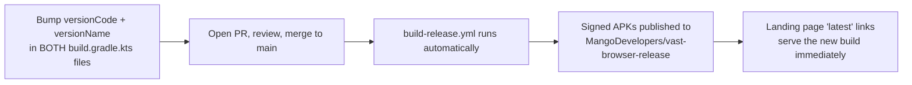
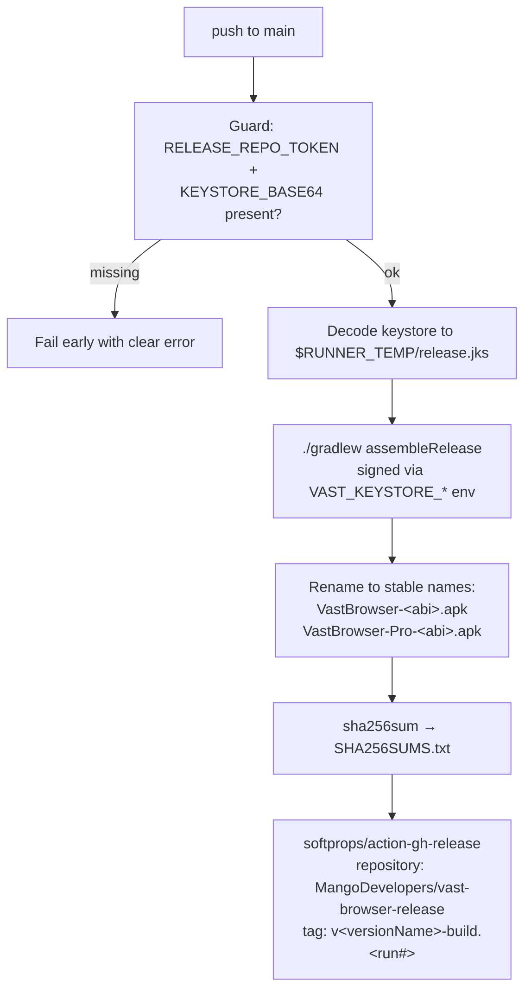

# How to Create a New Release

Practical runbook for shipping VastBrowser releases. Background and architecture are in
[release-strategy.md](release-strategy.md).

## TL;DR



Merging **anything** to `main` publishes a release — there is no separate release button.

## One-time setup checklist

These are already done (or need doing once). Verify before your first release:

| Item | Where | Status check |
|---|---|---|
| `KEYSTORE_BASE64` secret | private repo → Settings → Secrets → Actions | `gh secret list -R aman-tugnawat/vast-browser` |
| `KEYSTORE_PASSWORD` secret | same | same |
| `KEY_ALIAS` secret (= `vastbrowser`) | same | same |
| `RELEASE_REPO_TOKEN` secret | same | same — **must be created manually, see below** |
| Keystore backup | `~/keystores/vast-browser-release.jks` + credentials file → password manager | you did back it up, right? |

### Creating / renewing `RELEASE_REPO_TOKEN`

The token lets the private repo's CI create releases on the public repo. Fine-grained
PATs expire, so you will repeat this when releases start failing with `401`/`403`/
`Resource not accessible`.

1. GitHub → your avatar → **Settings** → **Developer settings** →
   **Fine-grained personal access tokens** → **Generate new token**.
2. Name: `vast-browser-release-publisher`. Expiration: 1 year (max allowed is fine).
3. **Resource owner**: `MangoDevelopers` (the org owning the release repo).
4. **Repository access**: *Only select repositories* → `MangoDevelopers/vast-browser-release`.
5. **Permissions** → Repository permissions → **Contents: Read and write**. Nothing else.
6. Generate, copy the token, then:

```bash
gh secret set RELEASE_REPO_TOKEN -R aman-tugnawat/vast-browser
# paste the token when prompted
```

> If the org restricts fine-grained PAT access, approve it under
> MangoDevelopers → Settings → Third-party Access → Personal access tokens.

## Publishing a normal release

1. **Bump the version in BOTH modules** — they are kept in sync manually:

   - `VastBrowser/vast-browser/build.gradle.kts`
   - `VastBrowser/vast-browser-pro/build.gradle.kts`

   ```kotlin
   versionCode = 3          // ALWAYS increment — Android refuses downgrades
   versionName = "0.4.0"    // what users and release tags show
   ```

2. **Open a PR to `main`**, review, merge.

3. **Watch the build** (~5–10 min):

   ```bash
   gh run watch -R aman-tugnawat/vast-browser
   ```

4. **Verify the release** appeared with all 9 assets (8 APKs + `SHA256SUMS.txt`):

   ```bash
   gh release view -R MangoDevelopers/vast-browser-release
   ```

5. Spot-check a download link (this is what the landing page uses):

   ```bash
   curl -sIL https://github.com/MangoDevelopers/vast-browser-release/releases/latest/download/VastBrowser-arm64-v8a.apk | grep -E '^HTTP|content-length'
   ```

That's it — the landing page needs no changes; its `latest/download/` links follow
automatically.

### What the workflow does under the hood



## Automated releases when Firefox/Mozilla engine updates

You don't have to do anything to *notice* engine updates — `version-check.yml` checks
Mozilla's Maven repo daily at 12:00 UTC and opens a PR like
**"🔄 Update Mozilla Components: 150.0.2 → 151.0"** when a new stable lands
(betas are filtered out).

Your job is only to review that PR:

1. Check the PR's verification checklist:
   - CI build succeeds.
   - Quick smoke test on an emulator or TV: browse a few sites, D-pad cursor works.
   - For **Pro** (GeckoView), also confirm extensions still load.
2. Merge it → a new signed release publishes automatically (same pipeline as above).
3. To **reject** an engine version: close the PR without merging. The workflow will not
   recreate a PR for a version whose PR exists in any state — the next *newer* version
   will get a fresh PR.

Consider bumping `versionCode`/`versionName` in the engine PR (or a follow-up) when the
engine jump is user-visible, so the release tag reflects it.

## Manual / emergency actions

- **Re-run a release without a new commit**: Actions → *Build & Release* → *Run workflow*
  (`workflow_dispatch`), or `gh workflow run build-release.yml -R aman-tugnawat/vast-browser`.
- **Delete a bad release** so `latest` falls back to the previous good one:

  ```bash
  gh release delete v0.4.0-build.43 -R MangoDevelopers/vast-browser-release --cleanup-tag
  ```

- **Build a signed APK locally** (e.g. to test the exact bits users get):

  ```bash
  export JAVA_HOME=$(/usr/libexec/java_home -v 21)   # jenv shim on this machine is broken
  export VAST_KEYSTORE_FILE=~/keystores/vast-browser-release.jks
  export VAST_KEYSTORE_PASSWORD='<from credentials file>'
  export VAST_KEY_ALIAS=vastbrowser
  cd VastBrowser && ./gradlew assembleRelease
  ```

  Without the env vars, `assembleRelease` still works but produces **unsigned** APKs.

## Traffic analytics

### Google Analytics (already live)

The landing page reports to the existing property **G-QVE8EH4YDB** — view at
<https://analytics.google.com/>. Besides page views, each download click fires an
`apk_download` event carrying a `flavor` parameter, so you can build a report of which
flavor/ABI users pick.

### Cloudflare Web Analytics (5-minute setup, currently stubbed)

1. Sign in at <https://dash.cloudflare.com/> → **Web Analytics** → **Add a site** →
   enter `mangodevelopers.com` (no DNS/proxy change needed — choose the JS snippet option).
2. Copy the **token** from the provided snippet.
3. In `MangoDevelopers/mangodevelopers.github.io`, edit `apps/vast-browser/index.html`:
   find the commented-out `beacon.min.js` block near the top, replace `YOUR_CF_TOKEN`
   with your token, and remove the surrounding HTML comment markers.
4. Commit and push; stats appear in the Cloudflare dashboard within minutes.

Optionally add the same snippet to the site's root `index.html` to cover the homepage.

### Download counts (no setup, server-side truth)

```bash
# per-asset counts across all releases
gh api repos/MangoDevelopers/vast-browser-release/releases \
  --jq '.[] | .tag_name as $t | .assets[] | "\($t)\t\(.download_count)\t\(.name)"'
```

The landing page also shows a live total (client-side fetch of the same API).

## Troubleshooting

| Symptom | Likely cause | Fix |
|---|---|---|
| Workflow fails at *Verify release credentials* | `RELEASE_REPO_TOKEN` or `KEYSTORE_BASE64` secret missing | Add the secret (see one-time setup) |
| Release step fails `401`/`403`/`Resource not accessible` | PAT expired or org hasn't approved it | Regenerate token, `gh secret set RELEASE_REPO_TOKEN …` |
| `keytool error` / `Keystore was tampered with` in build | Wrong `KEYSTORE_PASSWORD` or corrupted `KEYSTORE_BASE64` | Re-upload: `base64 -i ~/keystores/vast-browser-release.jks \| gh secret set KEYSTORE_BASE64 -R aman-tugnawat/vast-browser` |
| Device says "App not installed" on update | Signature mismatch — user has an old debug/differently-signed install | They must uninstall once, then install the signed APK |
| Landing page shows `Latest: —` / `Downloads: —` | No release exists yet, or GitHub API rate limit (60 req/hr/IP unauthenticated) | Publish a release; rate limits recover on their own |
| Engine PR never appears despite new Firefox | A PR for that version was closed before, or Maven only has betas | Bump `mozComponentsVersion` manually, or wait for the next stable |
| `x86` users report crashes | Rare ABI, least tested | Ask for `adb logcat`; consider dropping the split if unmaintained |

## Invariants — do not break these

- **Never lose the keystore or its password** (`~/keystores/…` + password manager).
- **Never change the signing key** — existing installs would stop updating.
- **Never rename the release assets** — `latest/download/<name>` links on the landing
  page and public README depend on the exact names.
- **Always bump `versionCode`** when users should receive the build as an update.
- **Keep both flavor modules' versions in sync** — nothing enforces it automatically.
