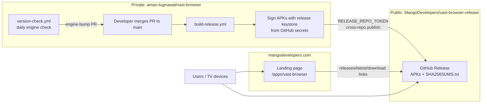
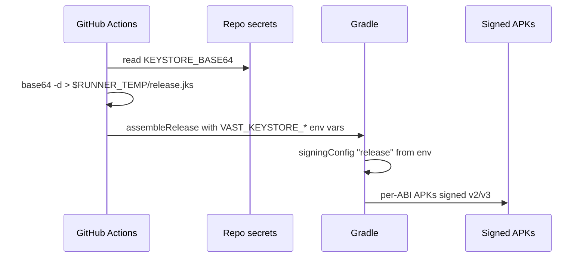
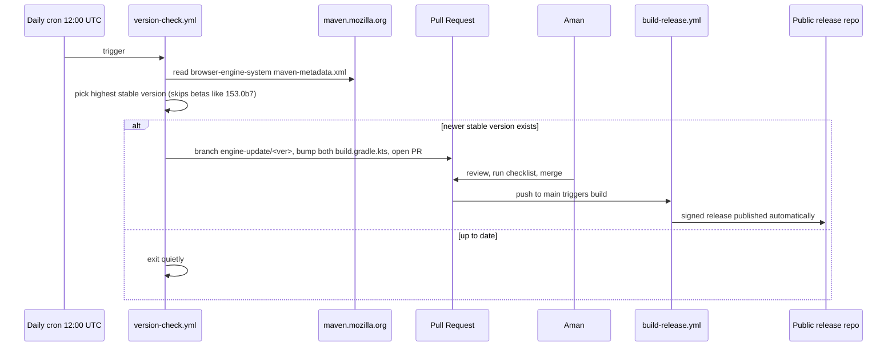
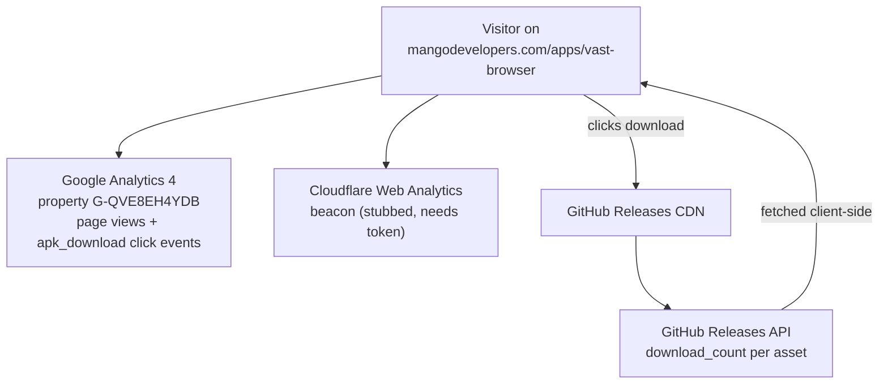

# Release Strategy

This document explains how VastBrowser is built, signed, and distributed while keeping the
source code private, and how visitors and downloads are tracked. For the step-by-step
operational guide, see [how-to-create-new-release.md](how-to-create-new-release.md).

## Goals

1. **Source stays private** — the app code lives only in this private repo.
2. **APKs are public and free** — anyone can download every release without a GitHub account.
3. **Releases are fully automated** — a merge to `main` produces a signed, published release.
4. **Engine updates are automated** — new Mozilla Components (Firefox engine) versions arrive
   as review-ready PRs every day.
5. **Traffic and downloads are measurable** — page analytics plus per-APK download counts.

## The three repositories

| Repo | Visibility | Role |
|---|---|---|
| [`aman-tugnawat/vast-browser`](https://github.com/aman-tugnawat/vast-browser) | **Private** | Source code, CI workflows, signing secrets. Nothing here is ever exposed. |
| [`MangoDevelopers/vast-browser-release`](https://github.com/MangoDevelopers/vast-browser-release) | **Public** | Distribution only: README + GitHub Releases holding the APKs. Contains no code. |
| [`MangoDevelopers/mangodevelopers.github.io`](https://github.com/MangoDevelopers/mangodevelopers.github.io) | **Public** | GitHub Pages site. The landing page lives at `apps/vast-browser/` → <https://mangodevelopers.com/apps/vast-browser/>. |

GitHub does not allow public downloads from a private repo's releases, so the build runs
here (private) and *publishes* the release cross-repo into the public repo using a
fine-grained personal access token (`RELEASE_REPO_TOKEN` secret).

## Big picture



## APK signing

Release APKs are signed with a dedicated release keystore so that:

- Android accepts **updates** — an APK signed with a different key cannot update an
  installed app; users would have to uninstall and lose their data.
- Users and stores can verify the APKs really come from Mango Developers.

### Key material

| Item | Value / Location |
|---|---|
| Keystore file | `~/keystores/vast-browser-release.jks` (on the dev machine — **never in the repo**) |
| Credentials note | `~/keystores/vast-browser-release-credentials.txt` |
| Key alias | `vastbrowser` |
| Algorithm | RSA 4096, validity ~30 years |
| Certificate SHA-256 | `db1ea7941ec56b2063c1dc75b1851e0f8cc1b28e07a5d4d2600d1e993e68878b` |

> ⚠️ **Back up the keystore and its password in a password manager.** If either is lost,
> no further updates can be shipped to existing installs — a new key means every user must
> uninstall/reinstall. There is no recovery path; Google cannot help for sideloaded apps.

### How CI signs

The Gradle config in both `VastBrowser/vast-browser/build.gradle.kts` and
`VastBrowser/vast-browser-pro/build.gradle.kts` reads signing material from environment
variables and falls back to an **unsigned** build when they are absent (so local
`assembleRelease` still works without secrets):

| Env var | Fed from GitHub secret | Meaning |
|---|---|---|
| `VAST_KEYSTORE_FILE` | `KEYSTORE_BASE64` (decoded to `$RUNNER_TEMP/release.jks`) | Path to the keystore |
| `VAST_KEYSTORE_PASSWORD` | `KEYSTORE_PASSWORD` | Store + key password (same value) |
| `VAST_KEY_ALIAS` | `KEY_ALIAS` | Key alias (`vastbrowser`) |



To verify a downloaded APK is authentic:

```bash
apksigner verify --print-certs VastBrowser-arm64-v8a.apk
# Signer #1 certificate SHA-256 digest must be
# db1ea7941ec56b2063c1dc75b1851e0f8cc1b28e07a5d4d2600d1e993e68878b
```

## Release publishing

`build-release.yml` runs on every push to `main` (and via manual dispatch):

1. Fails fast if `RELEASE_REPO_TOKEN` or `KEYSTORE_BASE64` secrets are missing.
2. Builds **signed release** APKs for both flavors, split per ABI
   (`armeabi-v7a`, `arm64-v8a`, `x86`, `x86_64`).
3. Renames them to **stable asset names** and generates `SHA256SUMS.txt`:
   - `VastBrowser-<abi>.apk` — regular flavor (system WebView engine)
   - `VastBrowser-Pro-<abi>.apk` — pro flavor (bundled GeckoView engine)
4. Creates a GitHub Release **on the public repo** tagged
   `v<versionName>-build.<run_number>` (e.g. `v0.3.0-build.42`).

The stable names are **load-bearing**: the landing page and the public README link to

```
https://github.com/MangoDevelopers/vast-browser-release/releases/latest/download/VastBrowser-arm64-v8a.apk
```

which always resolves to the newest release without anyone editing the website.
**Do not rename the assets** without updating the landing page and README.

### The cross-repo token

`RELEASE_REPO_TOKEN` is a **fine-grained PAT** scoped to *only*
`MangoDevelopers/vast-browser-release` with **Contents: Read and write**. It cannot touch
the private source repo, so even if leaked it exposes nothing private. Fine-grained PATs
expire — when releases start failing with 401/403, regenerate it (see the how-to doc).

## Automated engine (Firefox) updates

Mozilla ships new engine versions on the Firefox release train (~every 4 weeks).
`version-check.yml` keeps the app current automatically:



Details worth knowing:

- It reads the **stable** version list from Maven metadata, ignoring Mozilla's
  `<latest>`/`<release>` tags because those point at betas.
- It bumps `mozComponentsVersion` in **both** flavor modules.
- Deduplication is PR-based: if a PR for that version already exists (open, merged, **or
  closed**), it will not recreate it. Closing an engine PR is therefore how you *reject*
  an engine version permanently.
- Merging the engine PR is all it takes — the release to the public repo follows
  automatically.

## Landing page, traffic analytics, and download tracking

The landing page (`apps/vast-browser/` in the Pages repo) serves three tracking layers:



1. **Google Analytics 4** — already live. The page reuses the site-wide property
   `G-QVE8EH4YDB`, so visits appear in the same GA dashboard as the rest of
   mangodevelopers.com. Every download button click also fires an `apk_download` event
   with a `flavor` parameter (e.g. `VastBrowser-Pro-arm64-v8a`), so GA can break down
   which flavor/ABI people choose.
2. **Cloudflare Web Analytics** — privacy-friendly, cookie-free second opinion. The
   beacon `<script>` is present in the page but **commented out pending a token**; see the
   how-to doc for the 5-minute setup.
3. **GitHub download counts** — the source of truth for actual downloads, counted
   server-side by GitHub regardless of where the click came from (landing page, README,
   Reddit, etc.). The landing page fetches these client-side and displays a live total,
   and you can query them anytime:

```bash
# downloads per asset, all releases
gh api repos/MangoDevelopers/vast-browser-release/releases \
  --jq '.[].assets[] | "\(.download_count)\t\(.name)"'
```

## Security notes

- The private repo never exposes: source code, keystore, passwords, tokens. Secrets are
  masked in workflow logs by GitHub.
- The public repo receives only compiled, signed APKs and release notes. Release notes
  include the app/engine versions but no commit history or code references (the commit
  SHA of the private repo is intentionally not included).
- The `RELEASE_REPO_TOKEN` follows least privilege: one repo, contents scope only.
- `SHA256SUMS.txt` in each release lets users verify download integrity; the certificate
  fingerprint above lets them verify authenticity.
